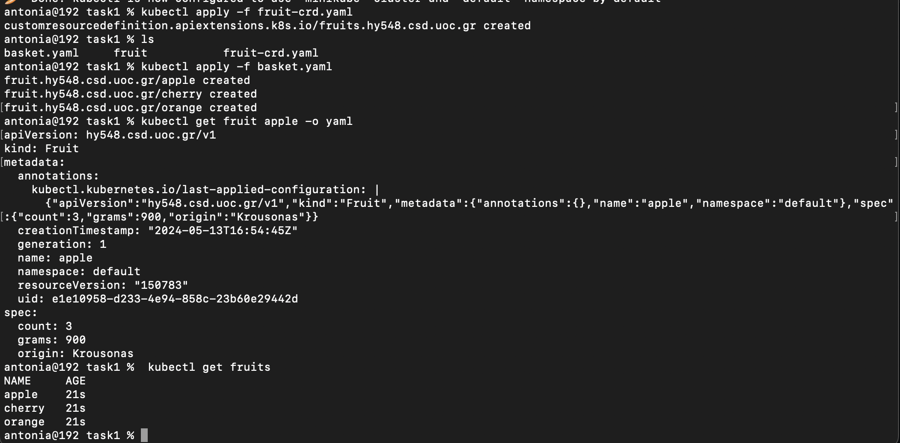

# Assignment 3
---------------------
## csd4140 | Antonia Krasoudaki

### Task 1

* a )
kubectl apply -f fruit-crd.yaml

* b )
kubectl apply -f basket.yaml

* c )
kubectl get fruit apple -o yaml

* d )
  kubectl get fruits

  

  ### Task 2

* a )
  
docker build -t antoniakras/greeting-controller:latest .

docker push antoniakras/greeting-controller:latest

In the Dockerfile the image python:slim-buster is being pulled. It updates downloads kubectl and installs it,
At the path /app it copies the appropriate files and installs the requirements.
Finally, the controller is running.

* b )
  
Apply crd and the deployment:

kubectl apply -f greeting-crd.yaml
kubectl apply -f greeting-controler.yaml

In the deployment CLusterRole we use * in rules to make sure that
the right role and access is granted. ClusterRoleBinding references greeting-cluster-role 
and binds it with service account. 

To make sure everything is running properly we execute the command:
kubectl describe deployments 

  
